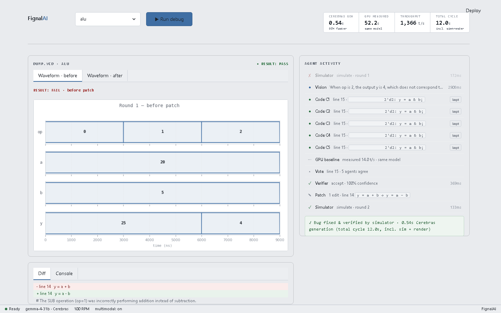

# FignalAI ⚡

**A self-healing RTL debug agent powered by Gemma 4 on Cerebras.**

Feed it a buggy Verilog module and its testbench. FignalAI runs the simulation,
reads the waveform with a vision agent, debates the root cause across five
parallel code agents, votes on the winner, patches the source, and
**re-runs the simulator to prove the fix** — the oracle is always the
simulator, never another LLM.

Built for the [Cerebras × Google DeepMind Gemma 4 Hackathon](https://cerebras.ai).



---

## How it works

```
run_sim() → FAIL
    └── render_waveform()          VCD → PNG  (+ per-cycle text table)
        └── Vision agent           waveform → structured anomaly   (multimodal)
            └── Code agents ×K      parallel root-cause hypotheses  (t=1 fan-out)
                └── line_check()    deterministic hallucination guard
                    └── majority    self-consistency vote
                        └── Verifier  advisory LLM sanity check
                            └── Patch  minimal multi-edit diff
                                └── run_sim() → PASS ✓
```

The loop retries up to 3 rounds. If the patched module passes its self-checking
testbench, the bug is proven fixed — **the simulator is the oracle, never an LLM.**
Every run is on a disposable copy of the design, so the demo is repeatable: each
run starts from the original bug.

### Hybrid multimodal vision

The Vision agent reads the waveform as a **PNG image** *and* an exact
**per-clock-cycle text table** at the same time (`VISION_MODE=hybrid`). Both are
derived from the VCD we parse ourselves, so the picture and the numbers always
agree — the model gets the readability of an image with the precision of the
parsed values. `image` and `text` modes are also available for models without
multimodal access.

---

## Quick start

### 1. Prerequisites

```bash
# Icarus Verilog simulator
winget install IcarusVerilog    # Windows  (or: choco install iverilog)
sudo apt install iverilog       # Linux
brew install icarus-verilog     # macOS

# Python dependencies
pip install -r requirements.txt
```

Verify the simulator is on PATH: `iverilog -V`.

### 2. API key

```bash
cp .env.example .env
# edit .env and add your CEREBRAS_API_KEY
```

Get a Cerebras key at [cloud.cerebras.ai](https://cloud.cerebras.ai).

### 3. Run the app

```bash
streamlit run app.py
```

Open [http://localhost:8501](http://localhost:8501), pick an example, and click
**Run debug**.

---

## Run the tests

```bash
pytest -q
```

38 tests covering the deterministic core — VCD parsing/rendering, the
hallucination guards, multi-edit patching, coverage + hole detection, the
hunt loop, and the bug injector. Requires `iverilog` on PATH for the
simulation-backed tests.

---

## Project structure

```
fignalai/
├── app.py             Streamlit dashboard (live timeline + honest speed strip)
├── orchestrator.py    Closed-loop controller (async event stream)
├── agents.py          Prompts + JSON schemas (Vision · Code · Verifier · Patch)
├── cerebras.py        Cerebras API wrapper (rate limiter + timing + baseline)
├── tools.py           read_rtl · run_sim · apply_patch · apply_patches
├── render.py          VCD → PNG renderer + per-cycle text table (no GTKWave)
├── checks.py          Deterministic hallucination guards (quoted-line check)
├── coverage.py        Toggle coverage + hole detection from a VCD
├── hunt.py            Coverage-driven bug-hunting loop
├── hunt_agent.py      Gemma stimulus generator (picks input vectors)
├── mutate.py          Deterministic bug injector (proves generality)
└── examples/
    ├── counter/       Off-by-one mod-10 counter        (1-line fix)
    ├── fsm/           Wrong transition — never reaches DONE (1-line fix)
    ├── shiftreg/      Blocking '=' instead of '<='      (3-line multi-edit fix)
    └── alu/           SUB opcode computes a + b         (1-line fix)
```

---

## Beyond the core loop

- **Multi-edit patches** (`tools.apply_patches`): one patch changes several lines
  atomically (validate-all-then-apply), so a multi-line bug such as
  blocking→non-blocking assignment fixes in a single round.
- **Coverage-driven bug hunting** (`hunt.py` + `coverage.py` + `hunt_agent.py`):
  simulate → measure toggle coverage → find holes (stuck bits / unreached states)
  → Gemma regenerates stimulus aimed at the holes → repeat to a threshold. A hole
  no stimulus can close is a real bug, handed to the diagnose/patch loop.
- **Bug injector** (`mutate.py`): deterministic mutation operators (off-by-one,
  blocking, comparison-flip, arithmetic-flip) turn known-good RTL into a fresh
  bug — proof the loop fixes bugs it has never seen rather than memorising them.

The coverage hunt currently runs from the API/CLI; wiring it into the dashboard
is the next step.

---

## Why Cerebras makes this work

A diagnose-and-patch round is K parallel hypotheses plus vision, verifier and
patch calls. The honest metric the dashboard reports is **summed generation
time** across those calls — *Cerebras gen* — versus the **measured** time the
*same* token workload takes on a GPU running the *same* gemma-4-31b model (the
*GPU* card; measured live through a free OpenRouter host, or an estimate when no
baseline host is set).

At well over 1,000 tok/s, Cerebras turns a multi-pass agentic debate into
something interactive (~0.5 s of generation) instead of a batch job. The
simulator (compile + run + render) is local and Cerebras can't speed it up —
that's the honest bottleneck reported separately as *Total cycle*, and it's
still sub-second on these modules.

---

## Configuration

All tunable via `.env` (see `.env.example`). Defaults target the full Cerebras
tier (100 RPM / 100K TPM); on the free tier the loop paces itself to avoid 429s.

| Var | Default | Notes |
|-----|---------|-------|
| `CEREBRAS_MODEL` | `gemma-4-31b` | multimodal target; `gpt-oss-120b` works text-only |
| `CEREBRAS_EFFORT` | `none` | gemma uses `none`; gpt-oss needs `low\|medium\|high` |
| `CEREBRAS_RPM` | `100` | requests/min for the rolling-window pacer |
| `CODE_K` | `5` | parallel code samples for the self-consistency vote |
| `CODE_TEMPERATURE` | `1.0` | gemma is robust at t=1 → real diversity for the vote |
| `ENABLE_VERIFIER` | `true` | advisory only — the simulator decides |
| `VISION_MODE` | `hybrid` | `hybrid` (PNG + per-cycle table) · `image` · `text` |
| `BASELINE_MODEL` | — | same model on a GPU host for the measured side-by-side |

---

## Example bugs included

Each bug is visually obvious in the waveform and backed by a self-checking
testbench (the oracle). Three are single-line; the shift register is a
three-line multi-edit fix.

| Module | Bug | Fix | Waveform anomaly |
|--------|-----|-----|------------------|
| `counter`  | `count == 4'd10` should be `4'd9` | `4'd10 → 4'd9` | count reaches 10 before wrapping |
| `fsm`      | `RUN` returns to `IDLE` not `DONE` | `state <= IDLE → DONE` | state never reaches DONE |
| `shiftreg` | middle stage samples `din`, not `q1` (blocking `=`) | `=` → `<=` (×3) | dout lags by 2 cycles, not 3 |
| `alu`      | SUB opcode computes `a + b` | `a + b → a - b` | y = 25 for op 1, never 15 |

---

## Tracks

- **Track 1 — Multiverse Agents:** multi-agent + multimodal waveform vision
- **Track 3 — Enterprise Impact:** EDA debug-workflow automation

---

## License

MIT
